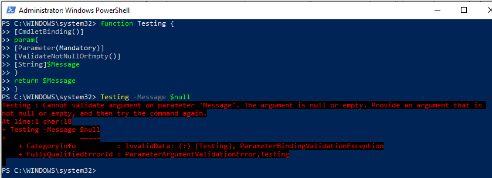

# PowerShell: Understanding ValidateNotNull and ValidateNotNullOrEmpty

The 'ValidateNotNull' and 'ValidateNotNullOrEmpty' are parameter attributes that are available within PowerShell advanced functions (see, about_Functions_Advanced). PowerShell advance function parameters and parameter attributes are used to validate and constrain function input. 

## ValidateNotNull validation attribute

The provided parameter of the function CANNOT be $null. If the parameter is evaluated to be $null PowerShell generates an error.


### When to use

Use this PowerShell advanced function attribute when the function parameter is not mandatory and the parameter type is not specified or undefined. 

### Understanding the usage

The ValidateNotNull attribute should be used when the provided value type is not known. A use case, a function that processes data where the data received by the function could be of multiple data types, i.e., bool, Int, String, etc., and is not Mandatory. 

### ValidateNotNull basic example


```
# Basic example of PowerShell [ValidateNotNull()] attribute
function TestValidateNotNull {
	[CmdletBinding()]
	Param(
		[Parameter()] # Note: The parameter is not mandatory
		[ValidateNotNull()]
		$DataObject
	)
	return $DataObject
}

# array of mixed data types
$MixedDataTypes = @( 1,"Two",$True,"Four",$null)

$MixedDataTypes | ForEach-Object {
	TestValidateNotNull -DataObject $_
}
```

### ValidateNotNull attribute exception handling example


```
# Generic exception handling example
function TestValidateNotNull {
	[CmdletBinding()]
	Param(
		[Parameter()] # Note: The parameter is not mandatory
		[ValidateNotNull()]
		$DataObject
	)
	return $DataObject
}

# array of mixed data types
$MixedDataTypes = @( 1,"Two",$True,"Four",$null)

try {
	$MixedDataTypes | ForEach-Object {
		TestValidateNotNull -DataObject $_
	}
} catch {
	Write-Host "Excpected a valid data type and received a Null value."
}
```

## ValidateNotNull attribute typed exception handling example


```
# Typed exception handling example
function TestValidateNotNull {
	[CmdletBinding()]
	Param(
		[Parameter()] # Note: The parameter is not mandatory
		[ValidateNotNull()]
		$DataObject
	)
	return $DataObject
}

# array of mixed data types
$MixedDataTypes = @( 1,"Two",$True,"Four",$null)

try {
	$MixedDataTypes | ForEach-Object {
		TestValidateNotNull -DataObject $_
	}
} catch [System.Management.Automation.ParameterBindingException] {
	throw [System.Management.Automation.ParameterBindingException]::New('Expected a valid data type, but received a Null value.')
}
```

## ValidateNotNullOrEmpty attribute

The provided parameter of the function CANNOT be $null and CANNOT be an empty string (""). PowerShell generates an error.



### When to use

Use this PowerShell advanced function attribute with all parameters that CANNOT accept a $null, empty string (""), or empty array (@()) value. 

### Understanding the usage

The ValidateNotNullOrEmpty attribute should be used on all parameters within a function that required input. A good use case would be a function that contains an optional parameter and accept any PSObject type. If the parameter is used, and the ValidateNotNullOrEmpty attribute is not set the function will accept the empty or $null values. 

### ValidateNotNullOrEmpty basic example


```
function Testing {
	[CmdletBinding()]
	Param(
		[Parameter()]
		[PSObject]$Message
	)
	return $Message
}

Testing -Message $null

# Nothing is returned

# Setting the ValidateNotNullOrEmpty() attribute

function Testing {
	[CmdletBinding()]
	Param(
		[Parameter()]
		[ValidateNotNullOrEmpty()]
		[PSObject]$Message
	)
	return $Message
}

Testing -Message $null

# returns the expected error
Testing : Cannot validate argument on parameter 'Message'. The argument is null or empty. Provide an argument that is not null or empty, and then try the command again.
At line:1 char:18
+ Testing -Message $null
+                  ~~~~~
    + CategoryInfo          : InvalidData: (:) [Testing], ParameterBindingValidationException
    + FullyQualifiedErrorId : ParameterArgumentValidationError,Testing
```

### ValidateNotNullOrEmpty attribute exception handling


```
function Testing {
	[CmdletBinding()]
	Param(
		[Parameter()]
		[ValidateNotNullOrEmpty()]
		[PSObject]$Message
	)
	return $Message
}

try {
	Testing -Message $null
} catch {
	Write-Host "Unable to show the message. $($_)"
}

# Returns
Unable to show the message. Cannot validate argument on parameter 'Message'. The argument is null or empty. Provide an argument that is not null or empty, and then try the command again.
```

### ValidateNotNullOrEmpty attribute typed exception handling


```
function Testing {
	[CmdletBinding()]
	Param(
		[Parameter()]
		[ValidateNotNullOrEmpty()]
		[PSObject]$Message
	)
	return $Message
}

try {
	Testing -Message $null
} catch [System.Management.Automation.ParameterBindingException] {
	throw [System.Management.Automation.ParameterBindingException]::New('The value provide to the Message parameter cannot be Null or Empty.')
}

# Returns
The value provide to the Message parameter cannot be Null or Empty.
At line:4 char:1
+ throw [System.Management.Automation.ParameterBindingException]::New(' ...
+ ~~~~~~~~~~~~~~~~~~~~~~~~~~~~~~~~~~~~~~~~~~~~~~~~~~~~~~~~~~~~~~~~~~~~~
    + CategoryInfo          : NotSpecified: (:) [], ParentContainsErrorRecordException
    + FullyQualifiedErrorId : RuntimeException
```

## References

- [Microsoft, ValidateNotNull validation attribute](https://docs.microsoft.com/en-us/powershell/module/microsoft.powershell.core/about/about_functions_advanced_parameters?view=powershell-7.1#validatenotnull-validation-attribute)
- [Microsoft, ValidateNotNullOrEmpty validation attribute](https://docs.microsoft.com/en-us/powershell/module/microsoft.powershell.core/about/about_functions_advanced_parameters?view=powershell-7.1#validatenotnullorempty-validation-attribute)
