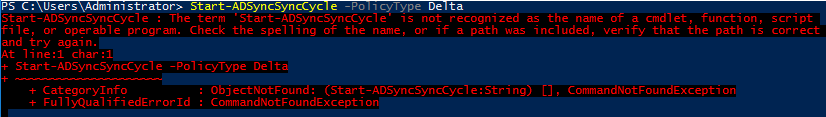
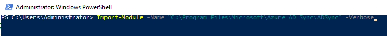
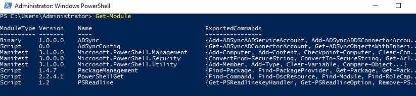
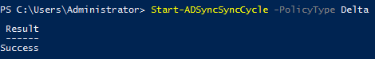

## Issue

After installing Azure AD Connect, the below error shows when attempting to manually start a sync via Windows PowerShell.



```
Start-ADSyncSyncCycle : The term 'Start-ADSyncSyncCycle' is not recognized as the name 
of a cmdlet, function, script file, or operable program. Check the spelling of the name, 
or if a path was included, verify that the path is correct and try again.
```

## Resolution

Import the ADSync PowerShell Module.

```
Import-Module -Name "C:\Program Files\Microsoft\Azure AD Sync\ADSync" -Verbose
```



Verify that the module is now available. 

```
Get-Module
```


Retry the sync via PowerShell

```
Start-ADSyncSyncCycle -PolicyType Delta
```


