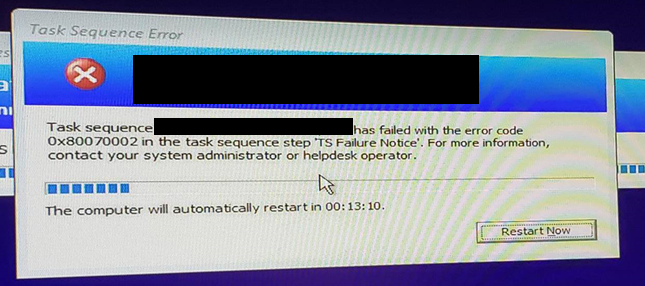
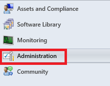
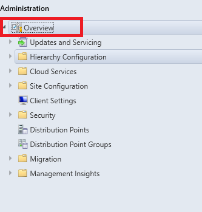
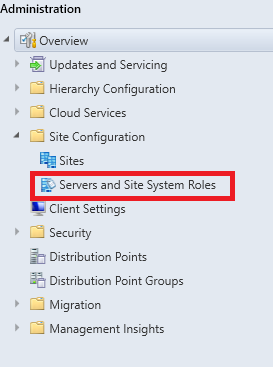
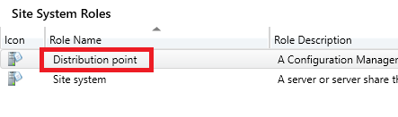
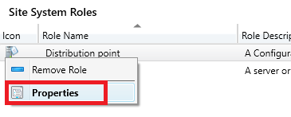
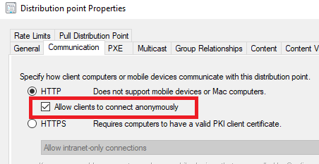

## Symptoms

- The above error randomly shows during the Apply Operating System task sequence step.
- The above error randomly shows during Install Configuration Manager Client task sequence step.

## Resolution

> **Warning** This resolution does not apply to MECM version 2103 and later. see, [Enable site system roles for HTTPS or Enhanced HTTP] (https://docs.microsoft.com/en-us/mem/configmgr/core/servers/deploy/install/list-of-prerequisite-checks#enable-site-system-roles-for-https-or-enhanced-http) for details.

### Enable Allow clients to connect anonymously within the Distribution Point(s)

If your environment is currently using HTTP protocol on MECM DPs, you will need to ensure that the setting 'Allow clients to connect anonymously' is checked.

1. Open the MECM Admin Console. 
2. Click on Administration. 
    

3. Expand the Overview node. 

4. Expand the Site Configuration node.
5. Click on Servers and Site System Roles

6. Select the DP (If you have more than 1 DP listed you will want to apply to all of the DPs listed.)
7. With the DP selected with the Servers and Site System Roles (Top) click on the Distribution point item under the Site System Roles, right click and select Properties.

8. Within the Distribution point Properties window, select the Communication tab. 
9. Locate the 'Allow clients to connect anonymously', and place a check mark.

